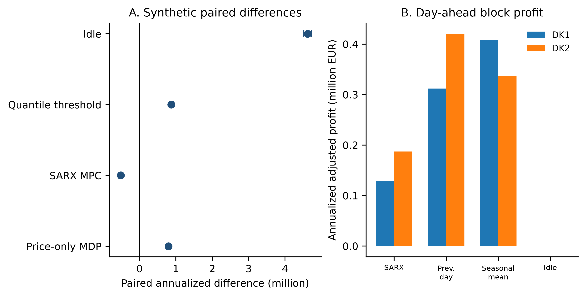

# VoltRL: Audit-Ready Battery-Arbitrage Benchmark

[](https://github.com/mohammadrezwankhan/voltrl/actions/workflows/python-validation.yml)

VoltRL is a research benchmark for finite-state battery-arbitrage control under
two explicit information protocols. Synthetic prices are revealed sequentially
and support a price-only versus price-plus-hour state ablation. Historical DK1
and DK2 day-ahead prices are evaluated using one 24-hour schedule fixed before
each delivery day; realized prices are used only for settlement. VoltRL is a
**benchmark, not a deployment or live bidding system**.

Public repository: <https://github.com/mohammadrezwankhan/voltrl>

## Documentation Map

- [Environment](#environment) for the pinned runtime.
- [Historical data](#historical-data) for source provenance and checksum requirements.
- [Reproduce the revised benchmark](#reproduce-the-revised-benchmark) for the canonical commands.
- [Main conventions](#main-conventions) for the physical and information assumptions.
- [Outputs](#outputs) for the manifest and audit trail.
- [Contributing](CONTRIBUTING.md) and [citation metadata](CITATION.cff) for shared results.

## What this benchmark demonstrates

VoltRL is an auditable research benchmark under two explicit information
protocols, not a live-trading or deployment system. Across 30 regenerated
synthetic datasets, seasonal autoregressive (SARX) 24-hour MPC has the highest
mean annualized adjusted profit (EUR 5.13M; 95% bootstrap CI EUR 5.05–5.23M),
versus EUR 4.62M for the hour-aware finite-horizon MDP (EUR 4.51–4.73M).
Historical DK1/DK2 schedules are fixed before delivery and use realized prices
only for settlement; SARX reports EUR 0.129M and EUR 0.187M annualized adjusted
profit, respectively, after modeled degradation. These protocol-bound results
show reproducible policy comparisons, not forecasts of live revenue or evidence
of deployment readiness.



*Primary result snapshot from the committed revision-2 bundle, generated by
the [`voltrl_benchmark.py`](voltrl_benchmark.py) command below. Panel A shows
paired annualized differences across 30 synthetic seeds; panel B shows
annualized adjusted profit for DK1 and DK2 24-hour schedules fixed before each
delivery day. The [experiment manifest](results_revision2/experiment_manifest.json)
and [audit commands](#outputs) define the information protocol and integrity
checks.*

## What changed in revision 2

- Three-fold expanding-window model selection replaces the invalid BIC-like
  criterion in the original illustrative script.
- Candidate resolutions `4,6,8,10,12,16,20,24,32,40,48` are scored by a
  continuous Gaussian-mixture next-price density with full real-line support,
  so holdout tail values are valid.
- Hierarchical empirical-marginal Dirichlet smoothing (strength 12) supports
  the expanded state-resolution search; the selected values are interior.
- The primary planner and evaluation now use the same undiscounted finite-
  horizon objective and terminal-inventory valuation.
- The exogenous state can include current UTC hour, addressing the known
  seasonal misspecification of a price-only Markov state.
- Thirty independently regenerated synthetic datasets propagate generator,
  fitting, model-selection, and evaluation variability.
- A ridge seasonal autoregression using price lags and daily, weekly, and annual
  harmonics replaces the training-hourly-mean MPC forecast.
- DK1 and DK2 use a day-ahead block protocol that prevents same-day realized
  prices from changing an already committed schedule.
- The primary reward replaces a purely linear throughput proxy with a
  normalized nonlinear DOD potential plus quadratic SOC stress. No-cost,
  linear, and nonlinear models are compared explicitly.
- Physical and planner sensitivities cover one-way efficiency
  `{0.90, 0.95, 1.00}`, degradation cost `{0, 5, 15}`, and planner discount
  `{0.95, 0.99, 1.00}`.

## Environment

Python 3.12 is recommended. Install the exact tested dependencies:

```powershell
python -m pip install -r requirements.txt
```

Continuous integration installs the same pinned environment and runs all unit
tests whenever Python sources or dependencies change.

## Historical data

Download `time_series_60min_singleindex.csv` from the official
[OPSD 2020-10-06 package](https://data.open-power-system-data.org/time_series/2020-10-06/).
The pipeline reads `DK_1_price_day_ahead` and `DK_2_price_day_ahead`. Twelve
internal missing hours per zone (0.024%, spring clock changes) are linearly
interpolated and reported in `data_quality.csv`. The exact local filename and
SHA-256 checksum are recorded in [`data/README.md`](data/README.md) and the
machine-readable [`data/opsd_source.json`](data/opsd_source.json). The benchmark
verifies the source filename and checksum before parsing any market data.

## Reproduce the revised benchmark

```powershell
python input_provenance.py `
  data\opsd_time_series_60min_singleindex_2020-10-06.csv

python voltrl_benchmark.py `
  --opsd-csv data\opsd_time_series_60min_singleindex_2020-10-06.csv `
  --output-dir results_revision2 `
  --synthetic-seeds 30 `
  --synthetic-hours 17520 `
  --candidates 4,6,8,10,12,16,20,24,32,40,48

python -m unittest discover -s tests -v
python result_bundle_audit.py results_revision2\experiment_manifest.json
```

The upper resolution is 48 rather than 12. Transition rows use hierarchical
smoothing, and the selection audit verifies that the optimum is not the upper
candidate.

## Main conventions

- Battery: 500 MWh capacity and 100 MW one-hour charge/discharge step.
- Main one-way charge/discharge efficiency: 0.95 (90.25% round trip).
- Main aging cost: 5 currency units/MWh nominal full-cycle normalization, 25%
  linear throughput component, DOD exponent 1.6, and quadratic SOC stress.
- SOC grid: 0, 100, 200, 300, 400, and 500 MWh.
- Chronological split: first 70% training/development, final 30% untouched
  holdout.
- Primary planner discount: 1.0; terminal SOC is valued at the training-median
  price with discharge efficiency applied.
- Historical actions are fixed as a complete 24-hour vector before the
  delivery day. The price-taking abstraction assumes accepted fixed quantities
  and still omits bid curves, fees, imbalance, and market impact.
- Perfect foresight is a diagnostic upper bound and is never available to any
  causal policy.

## Outputs

`results_revision2/` contains seed-level metrics, paired bootstrap summaries,
block-schedule historical results, forecast errors, model-selection folds,
aging and physical sensitivities, solver checks, a machine-readable manifest,
and PNG/PDF figures. Publication claims are based on `voltrl_benchmark.py` and
`results_revision2/`.

The manifest records the verified dataset digest and byte count, binds the
results to the exact Git commit and source-file digests used to generate them,
then declares every CSV and PNG/PDF figure with its byte size and SHA-256
digest. The experiment contract independently checks that manifest physics and
study settings agree with synthetic seed coverage, policy rows, the complete
candidate/fold grid, selected-bin diagnostics, chronological split sizes, and
reported sample counts. The synthetic statistics contract recomputes every
policy mean, sample standard deviation, mean oracle efficiency, paired mean,
positive-seed fraction, and annualized seed result from the underlying rows;
it also checks confidence-interval ordering and coverage of each reported mean.
The historical forecast contract then reconstructs
forecast errors and summary metrics from all timestamped rows, checks that each
24-hour block uses only information available before delivery, and confirms
that methods share the same realized prices and test horizon. Run the complete
applicable audit after cloning, downloading, copying, or archiving the results:

```powershell
python result_bundle_audit.py results_revision\experiment_manifest.json
python result_bundle_audit.py results_revision2\experiment_manifest.json --json
```

Revision 1 automatically skips the historical-forecast check because it does
not declare that protocol; revision 2 runs all five checks. The command exits
nonzero when configuration, forecast timing, recomputed
metrics, or result-table coverage drift; when a declared artifact is missing,
unrecorded, has malformed integrity metadata, is resized, or is changed; or when the recorded historical source
snapshot is absent or does not match its byte sizes and SHA-256 digests. Clean
runs are verified against immutable Git objects; runs made from uncommitted
code record and check the exact working-tree bytes instead. CSV files are
canonicalized to LF before hashing so the same table verifies on Windows and
Linux; PNG and PDF artifacts remain byte-exact.

The individual verifier commands remain available for focused diagnosis.

## Scope and Limitations

VoltRL is a reproducible benchmark for comparing explicitly defined policies;
it is not a live market interface, bidding strategy, revenue guarantee, or
grid-operations approval. The price-taking abstraction omits bid curves, fees,
imbalance settlement, market impact, outages, telemetry limits, and plant-level
degradation certification. Treat historical and synthetic results as
protocol-bound evidence, and document any change to the data, assumptions, or
objective before comparing runs.

## Contributing

Focused improvements to the benchmark contract, provenance checks, tests, and
documentation are welcome. Read [CONTRIBUTING.md](CONTRIBUTING.md), install the
pinned dependencies, and run the full test and artifact-audit commands before
opening a pull request.

## Citation

For papers, reports, or teaching material, cite the versioned metadata in
[CITATION.cff](CITATION.cff) and identify the exact result bundle and source
snapshot used.

## License

The software is released under the MIT License. Historical prices retain the
terms stated by Open Power System Data and its upstream providers.
